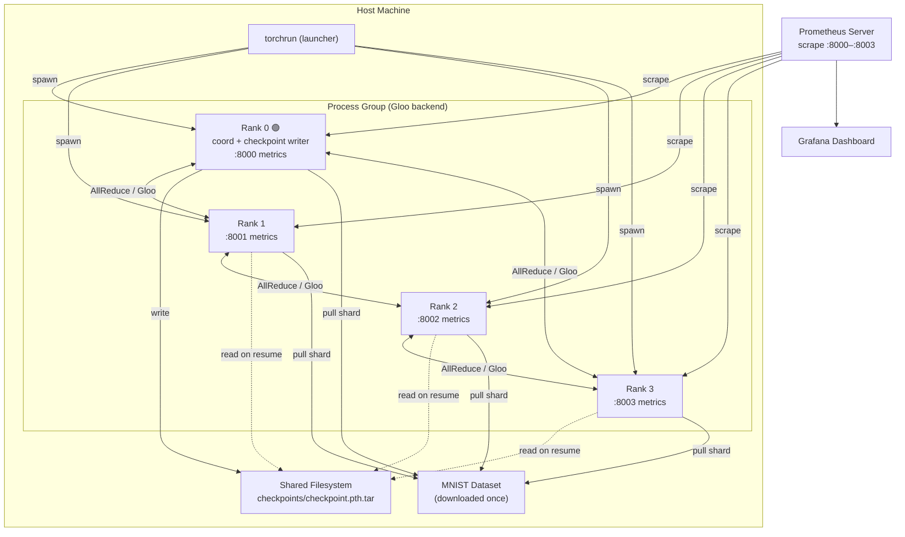
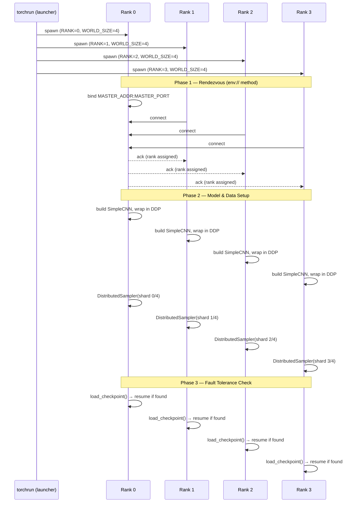
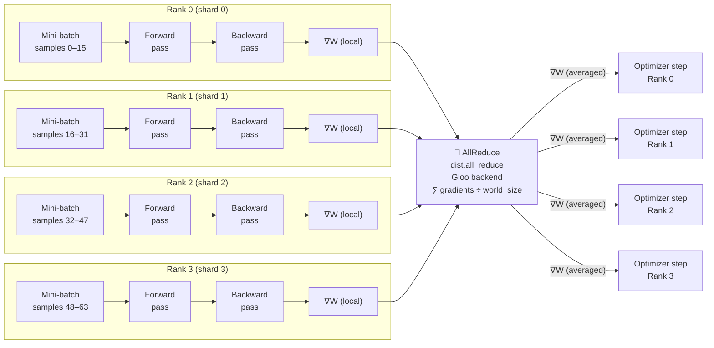
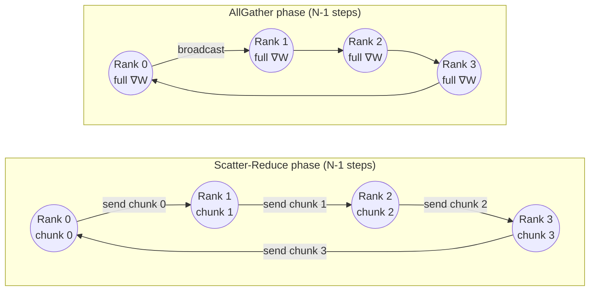
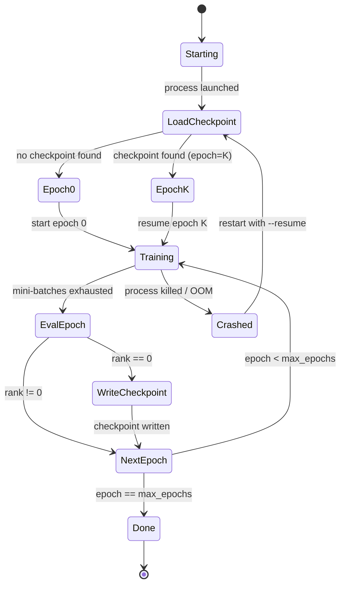
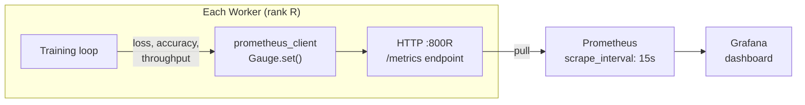

# Distributed AI Training — Architecture Deep Dive

This document explains the design of the distributed training simulator: how processes are initialized, how data flows, how gradients are synchronized, and how the system recovers from failures.

---

## 1. System Overview

Four worker processes (ranks 0–3) simulate a 4-node training cluster. Rank 0 doubles as the **rendezvous coordinator** and the sole writer of checkpoints. All ranks export Prometheus metrics independently.

---

## 2. Initialization Sequence

Before any training can begin, every rank must complete a **three-phase initialization**:

---

## 3. Training Loop — Data Parallelism

Each epoch follows a **forward → backward → AllReduce → optimizer step** cycle. The critical property of DDP is that `loss.backward()` *overlaps* gradient communication with the backward pass.

**Key guarantee:** After AllReduce, every rank has *identical* averaged gradients, so optimizer steps produce identical model weights — no manual synchronization needed afterwards.

---

## 4. Ring-AllReduce Algorithm

The Gloo backend implements **Ring-AllReduce**, which achieves near-100% bandwidth utilization regardless of the number of nodes (unlike parameter-server approaches that bottleneck at the PS).

**Bus bandwidth utilization:**
$$\text{BW} = \frac{2(N-1)}{2N} \cdot \text{link speed} \approx 100\%\ \text{for large } N$$

Compare to parameter-server AllReduce:
$$\text{BW}_{\text{PS}} = \frac{1}{N} \cdot \text{link speed}$$

At N=4, Ring-AllReduce uses **3× more** of the available bandwidth than a naïve PS approach.

---

## 5. Fault Tolerance — Checkpoint FSM

**What the checkpoint stores:**

| Key | Value |
|-----|-------|
| `epoch` | Last completed epoch (resumption point) |
| `state_dict` | `model.module.state_dict()` — weights only, not DDP wrapper |
| `optimizer` | Full `Adam` state (momentum, variance buffers) |

Only rank 0 writes the checkpoint to avoid **write contention** on shared filesystems. All ranks read it independently on resume.

---

## 6. Observability Stack

**Metrics exported per rank:**

| Metric name | Type | Description |
|-------------|------|-------------|
| `training_loss{rank="R"}` | Gauge | Mean cross-entropy loss for the epoch |
| `training_accuracy{rank="R"}` | Gauge | Top-1 accuracy (%) |
| `samples_per_second{rank="R"}` | Gauge | Mini-batch throughput |

Watching all ranks in Grafana lets you spot **straggler nodes** (one rank consistently slower → network bottleneck or CPU imbalance) — a critical operational signal in real clusters.

---

## 7. Scaling to Real Clusters

This simulator uses the **Gloo** CPU backend for portability. Production upgrades:

| Concern | Simulator | Production |
|---------|-----------|------------|
| Backend | `gloo` (CPU/Ethernet) | `nccl` (NVLink / InfiniBand) |
| Model | SimpleCNN (60 K params) | LLaMA-3 (8 B – 405 B params) |
| Parallelism | Data-parallel only | Data + Tensor + Pipeline (3D) |
| Checkpointing | Per-epoch, rank 0 | Async, distributed (Gemini/PyTorch FSDP) |
| Discovery | `env://` (manual) | Kubernetes + `c10d` etcd rendezvous |
| Monitoring | Prometheus Gauge | Weights & Biases / MLflow + custom kernels |

The architecture choices made here (DDP, DistributedSampler, ring communication, Prometheus observability) are direct analogues of what powers training at hyperscaler scale — just with smaller numbers.
